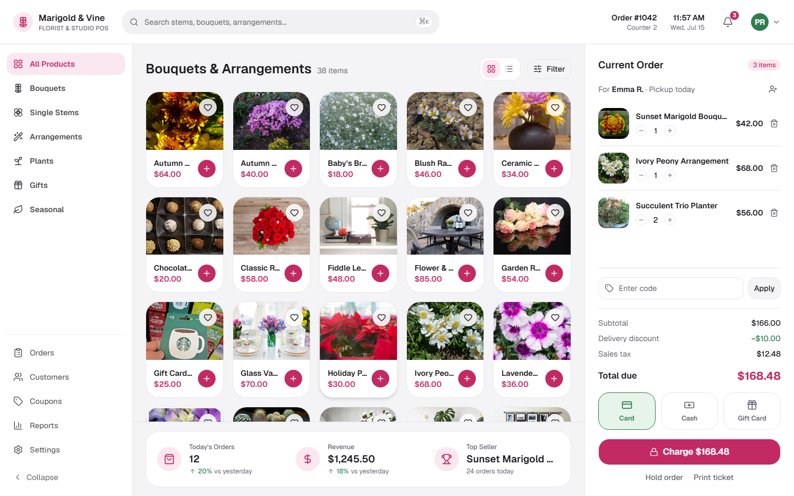

# Marigold & Vine POS

A florist counter point-of-sale built with React 19, Vite 8, Tailwind v4, and shadcn/ui — product grid, cart, coupons, orders, customers, and reports, fully responsive with dark mode.



**Live demo:** https://flowers.codespanda.com/
**Docs:** https://flowers.codespanda.com/docs
**Showcase:** https://flowers.codespanda.com/showcase

## Quick start

```bash
git clone https://github.com/codespanda/flowers-pos.git
cd flowers-pos
npm install
npm run dev
```

## Scripts

| Command | What it does |
| --- | --- |
| `npm run dev` | Start the Vite dev server with HMR. |
| `npm run build` | Type-check and build to `dist/`. |
| `npm run preview` | Serve the production build locally. |
| `npm run lint` | Run Oxlint across the project. |

See the [docs page](https://flowers.codespanda.com/docs) for project structure, routes, component usage, and theming.
